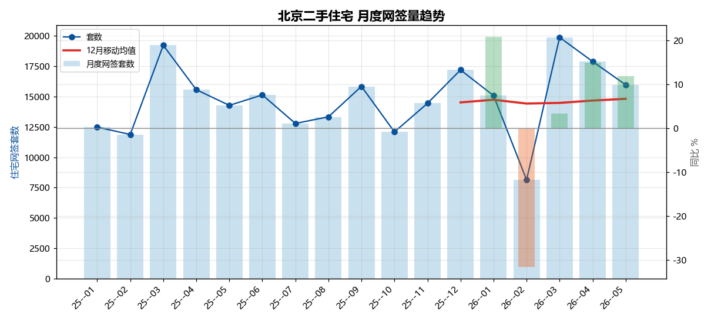
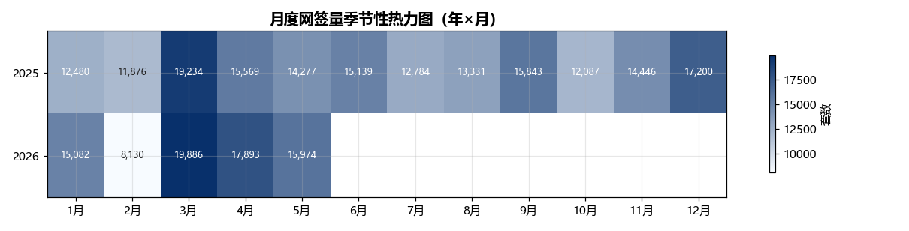
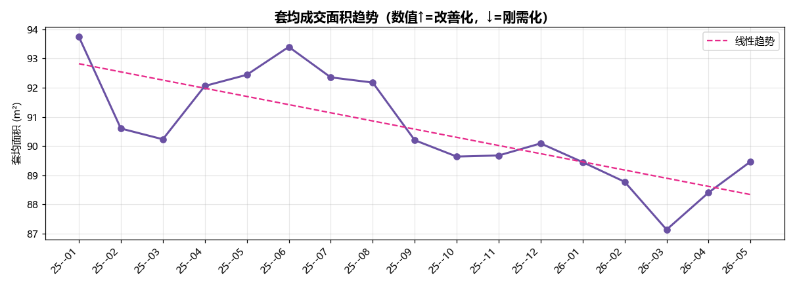
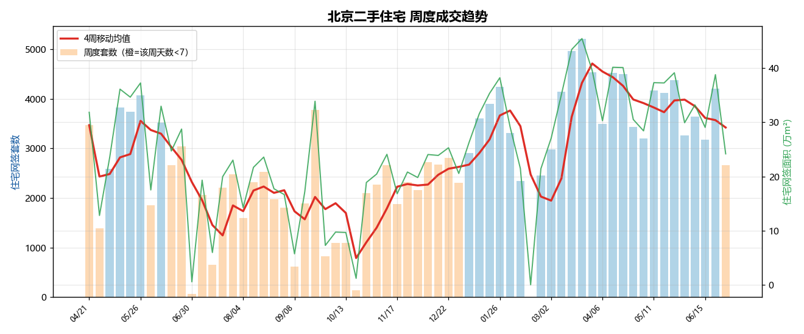
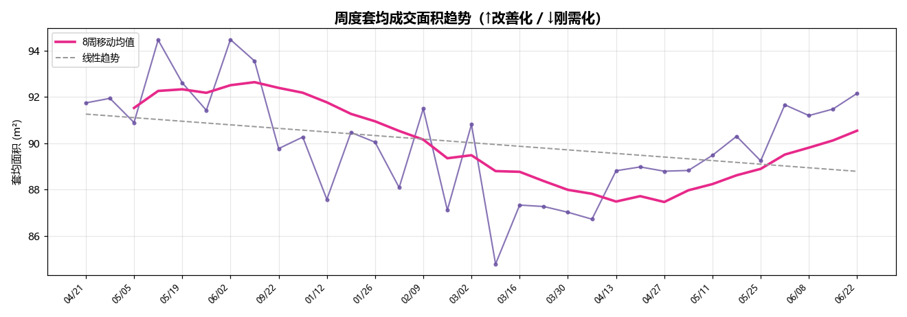
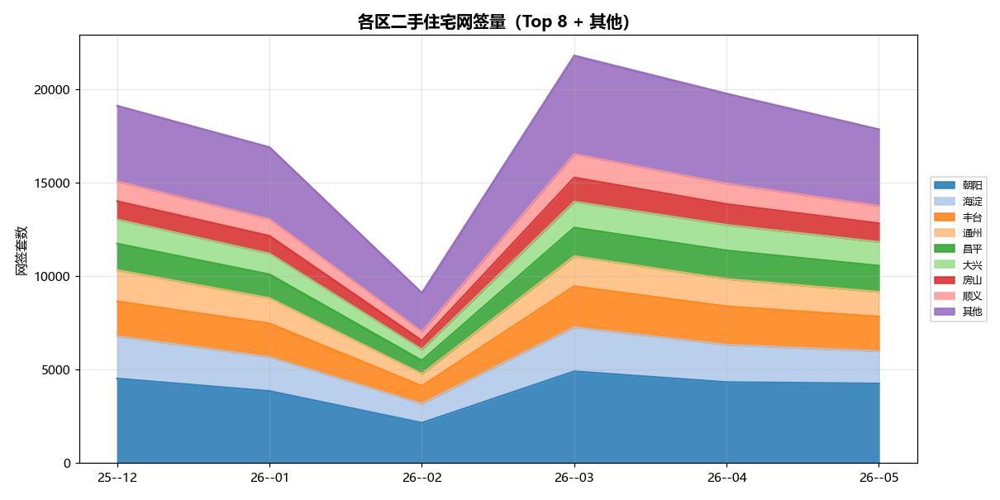
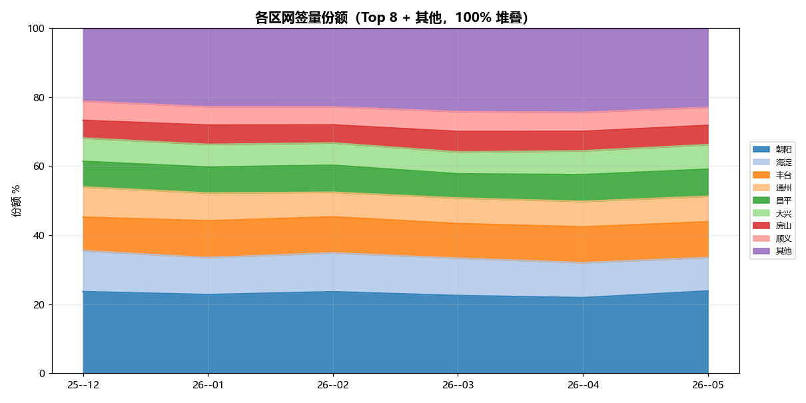
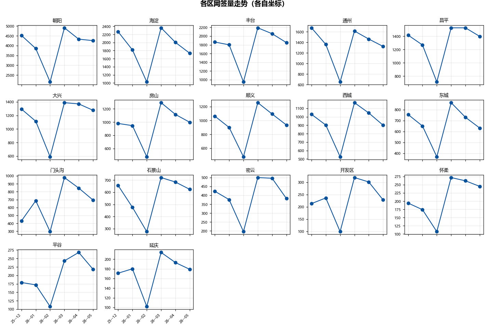
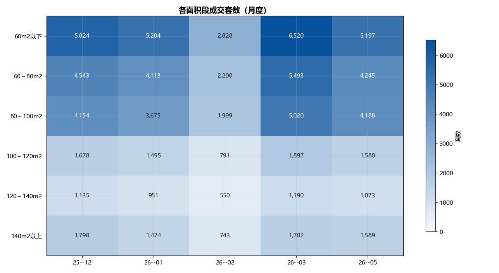
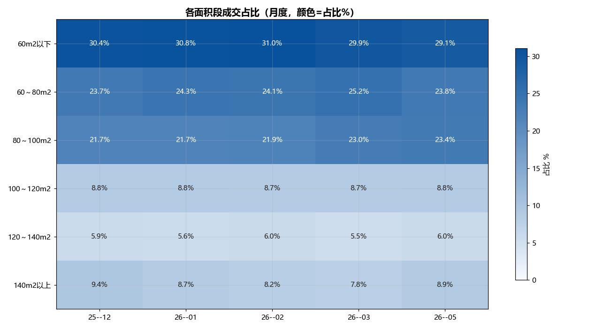

# 北京二手住宅成交趋势报告

> 数据范围：2025-01 ~ 2026-05（共 17 个月）· 数据来源：北京市住建委（官方自爬）· 仅历史趋势，不含预测

---

## 一、核心摘要

- **最新月份 2026-05**：住宅网签 **15,974 套**，环比 -10.7%，同比 +11.9%。

- **区间峰值**：2026-03（19,886 套）　**区间谷值**：2026-02（8,130 套）。

- **套均面积**：93.7 → 89.5 m²，下降（趋于刚需）。

- **年度长周期**（二手住宅，万套）：2020=16.46、2021=19.11、2022=14.09、2023=15.32、2024=17.32。

## 二、全市成交趋势

*月度网签套数 + 12 月移动均值 + 同比。移动均值剥离月度噪声看大方向。*

*年×月热力图。注意 2 月（春节）通常塌量、3-4 月及年末冲量——属季节性，勿误读为趋势拐点。*

### 月度明细

| 年月 | 住宅网签(套) | 环比 | 同比 | 住宅面积(m²) | 套均(m²) |
| --- | --- | --- | --- | --- | --- |
| 2026-05 | 15,974 | -10.7% | +11.9% | 1,429,178 | 89.5 |
| 2026-04 | 17,893 | -10.0% | +14.9% | 1,581,876 | 88.4 |
| 2026-03 | 19,886 | +144.6% | +3.4% | 1,732,824 | 87.1 |
| 2026-02 | 8,130 | -46.1% | -31.5% | 721,746 | 88.8 |
| 2026-01 | 15,082 | -12.3% | +20.8% | 1,349,072 | 89.4 |
| 2025-12 | 17,200 | +19.1% | — | 1,549,551 | 90.1 |
| 2025-11 | 14,446 | +19.5% | — | 1,295,485 | 89.7 |
| 2025-10 | 12,087 | -23.7% | — | 1,083,486 | 89.6 |
| 2025-09 | 15,843 | +18.8% | — | 1,429,049 | 90.2 |
| 2025-08 | 13,331 | +4.3% | — | 1,228,781 | 92.2 |
| 2025-07 | 12,784 | -15.6% | — | 1,180,634 | 92.4 |
| 2025-06 | 15,139 | +6.0% | — | 1,413,927 | 93.4 |
| 2025-05 | 14,277 | -8.3% | — | 1,319,764 | 92.4 |
| 2025-04 | 15,569 | -19.1% | — | 1,433,252 | 92.1 |
| 2025-03 | 19,234 | +62.0% | — | 1,735,524 | 90.2 |
| 2025-02 | 11,876 | -4.8% | — | 1,075,975 | 90.6 |
| 2025-01 | 12,480 | — | — | 1,169,917 | 93.7 |

## 三、周度成交趋势

> 基于 63 个自然周（2025-04-21 ~ 2026-06-29）。周度粒度比月度更能反映短期动能。

*柱=周度套数，红线=4 周移动均值，绿线=周度面积（右轴）。橙色柱表示该周天数 <7（节假日/抓取缺口），数值偏低（共 34 周）。*

### 近 10 周

| 周起始(周一) | 住宅网签(套) | 住宅面积(m²) | 套均(m²) | 天数 |
| --- | --- | --- | --- | --- |
| 2026-06-29 | 2,668 | 241,712 | 90.6 | 3 ⚠️ |
| 2026-06-22 | 4,209 | 387,898 | 92.2 | 7 |
| 2026-06-15 | 3,176 | 290,544 | 91.5 | 7 |
| 2026-06-08 | 3,641 | 332,061 | 91.2 | 7 |
| 2026-06-01 | 3,264 | 299,194 | 91.7 | 7 |
| 2026-05-25 | 4,385 | 391,339 | 89.2 | 7 |
| 2026-05-18 | 4,126 | 372,603 | 90.3 | 7 |
| 2026-05-11 | 4,169 | 373,072 | 89.5 | 7 |
| 2026-05-04 | 3,199 | 284,171 | 88.8 | 7 |
| 2026-04-27 | 3,436 | 305,112 | 88.8 | 7 |

*最新周 2026-06-29：2,668 套 / 241,712 m²，环比 -36.6%。*

*周度套均面积（仅画满 ≥6 天的周）。面积段分月只有少数点，套均面积可连续观察"成交往大还是往小走"。区间走势：上升（趋于改善）。*

## 四、区域格局

> 区县月度数据仅 6 个月（2025-12 ~ 2026-05），呈现短期格局，趋势需更长序列确认。

### 各区排名与变化

| 区县 | 最新套数 | 最新排名 | 首月排名 | 排名变化 | 份额变化 |
| --- | --- | --- | --- | --- | --- |
| 朝阳 | 4,255 | 1 | 1 | 0 | +0.18pp |
| 丰台 | 1,851 | 2 | 3 | +1 | +0.61pp |
| 海淀 | 1,735 | 3 | 2 | -1 | -2.14pp |
| 昌平 | 1,398 | 4 | 5 | +1 | +0.42pp |
| 通州 | 1,324 | 5 | 4 | -1 | -1.36pp |
| 大兴 | 1,276 | 6 | 6 | 0 | +0.38pp |
| 房山 | 997 | 7 | 9 | +2 | +0.46pp |
| 顺义 | 935 | 8 | 7 | -1 | -0.32pp |
| 西城 | 900 | 9 | 8 | -1 | -0.34pp |
| 门头沟 | 694 | 10 | 12 | +2 | +1.63pp |
| 东城 | 631 | 11 | 10 | -1 | -0.42pp |
| 石景山 | 624 | 12 | 11 | -1 | +0.06pp |
| 密云 | 382 | 13 | 13 | 0 | -0.07pp |
| 怀柔 | 245 | 14 | 15 | +1 | +0.36pp |
| 开发区 | 228 | 15 | 14 | -1 | +0.16pp |
| 平谷 | 218 | 16 | 16 | 0 | +0.28pp |
| 延庆 | 179 | 17 | 17 | 0 | +0.11pp |

## 五、市场结构

### 面积段成交量（月度）

### 面积段成交占比（月度）

*占比视角剥离总量波动（如 2 月春节全线塌量），更能看出结构迁移。当前 5 个月（2026-04 不可补、缺失），序列不连续。*

### 各面积段月度成交（套数 / 占比%）

| 面积区间 | 2025-12 | 2026-01 | 2026-02 | 2026-03 | 2026-05 | 占比变化(首→最新) |
| --- | --- | --- | --- | --- | --- | --- |
| 60m2以下 | 5,824 (30.4%) | 5,204 (30.8%) | 2,828 (31.0%) | 6,520 (29.9%) | 5,197 (29.1%) | -1.36pp |
| 60～80m2 | 4,543 (23.7%) | 4,113 (24.3%) | 2,200 (24.1%) | 5,493 (25.2%) | 4,245 (23.8%) | +0.01pp |
| 80～100m2 | 4,154 (21.7%) | 3,675 (21.7%) | 1,999 (21.9%) | 5,020 (23.0%) | 4,188 (23.4%) | +1.72pp |
| 100～120m2 | 1,678 (8.8%) | 1,495 (8.8%) | 791 (8.7%) | 1,897 (8.7%) | 1,580 (8.8%) | +0.07pp |
| 120～140m2 | 1,135 (5.9%) | 951 (5.6%) | 550 (6.0%) | 1,190 (5.5%) | 1,073 (6.0%) | +0.07pp |
| 140m2以上 | 1,798 (9.4%) | 1,474 (8.7%) | 743 (8.2%) | 1,702 (7.8%) | 1,589 (8.9%) | -0.51pp |

*占比变化为百分点(pp)。正值=该面积段份额上升，负值=下降。*

## 六、数据说明

- **主数据**：全部来自北京市住建委（pageId=307749）官方自爬，经完整性校验（面积/价格段加总=全市）。

- **月度覆盖**：2025-01 ~ 2026-05（17 个月）。区县 6 个月。面积段 5 个月（序列不连续）。

- **面积段 2026-04 永久缺失**：2026-03 已从 git 历史快照恢复；但 2026-04 的各面积段明细因解析器时间窗口 bug 永久丢失（4 月数据 5 月才上线，恰在解析器改版失效之后），官方无回溯、日数据无面积段拆分，无法恢复。全市总量（19784 套）仍可在区县数据中查到。

- **价格段**：官方近月仅发布成交数据（发布数据全为占位）、且仅 3 个月，不足以呈现趋势，已从报告中移除。

- **不含预测**：本报告仅呈现历史趋势，不预测未来。

- **历史数据**：官方无历史月度回溯接口；第三方历史因口径/可靠性未纳入主序列。

### 参考：上半年网签量长周期（媒体引用·非自爬）

> 经 2025 年验证口径与官方一致（媒体 88575 = 本项目自爬加总）。2022-2024 为媒体引用，仅作长周期参考，不参与主趋势计算。

| 年份 | 上半年二手住宅网签(套) |
| --- | --- |
| 2022 | 69,754 |
| 2023 | 84,332 |
| 2024 | 74,780 |
| 2025 | 88,575 |
